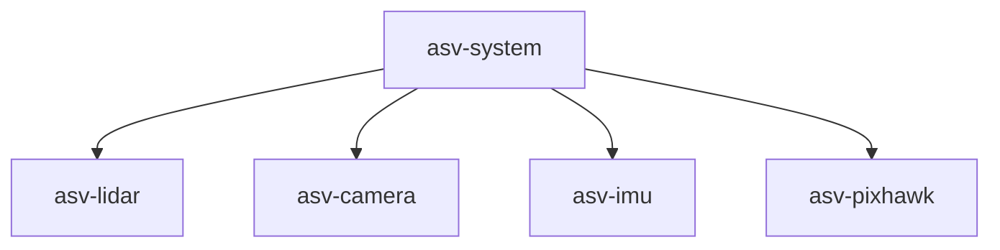

# Welcome :boat:
Iceberg ASV is a student-led, inter-disciplinary engineering competition team representing Memorial University at the annual International [RoboBoat](https://robonation.org/programs/roboboat/) Competition in Florida. Our team works collaboratively to design, construct, and test an Autonomous Surface Vehicle (ASV). 

# GitHub Structure
Outline of how our repositories are structured.

## asv-system
[asv-system](https://github.com/IcebergASV/asv) is our *main repository* that integrates all software used on our boat. There exists asv-system [submodules](https://www.atlassian.com/git/tutorials/git-submodule) for each hardware component, such as [asv-lidar](https://github.com/IcebergASV/asv-lidar) and [asv-camera](https://github.com/IcebergASV/asv-camera). 

## gz-simulator
[gz-simulator](https://github.com/IcebergASV/gz-simulator) contains all software and resources used in our GAZEBO simulation environment.

# Workflow 
## Feature Branch Workflow
Iceberg ASV uses a [Git Feature Branch Workflow](https://www.atlassian.com/git/tutorials/comparing-workflows/feature-branch-workflow). When a developer is working in a repository, they *must* must make or resolve an issue associated with that repository. The developer must also make a 'feature' branch to resolve the issue. 

If a developer runs into a problem while working to resolve an issue, they must make a new issue and a new feature branch to resolve the issue.

## Repository Readme
In each repository for hardware components it is essential that developers add the links and commands used to install packages on the TX2.
