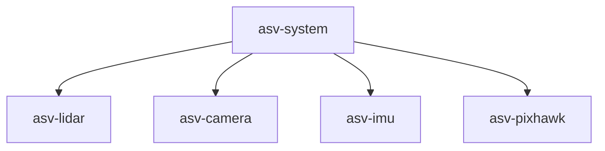

# Welcome :boat:
Iceberg ASV is a student-led, inter-disciplinary engineering competition team representing Memorial University at the annual International RoboBoat Competition in Florida. Our team works collaboratively to design, construct, and test an Autonomous Surface Vehicle (ASV). 

# GitHub Structure
Outline of how our repositories are structured.

## asv-system
[asv](https://github.com/IcebergASV/asv) is our 'main' repository that integrates all software used on our boat. There exists [asv-system] sub-modules for each hardware component, such as [asv-lidar] and [asv-camera]. 

## gz-simulator
[gz-simulator] contains all software and resources used in our GAZEBO simulation environment.

