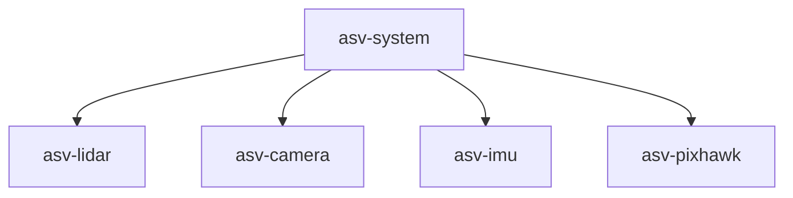

# Welcome :boat:
Iceberg ASV is a student-led, interdisciplinary engineering competition team representing Memorial University of Newfoundland at the annual International [RoboBoat](https://robonation.org/programs/roboboat/) competition in Sarasota, Florida. Our team collaborates to design, build, and test an Autonomous Surface Vehicle (ASV). 

# GitHub Structure
Outline of how our repositories are structured.

## asv-system
[asv-system](https://github.com/IcebergASV/asv) is our *main repository* that integrates all software used on our boat. There exists asv-system [submodules](https://www.atlassian.com/git/tutorials/git-submodule) for each hardware component, such as [asv-lidar](https://github.com/IcebergASV/asv-lidar) and [asv-camera](https://github.com/IcebergASV/asv-camera). 

``` mermaid
graph TD;
    asv-system-->asv-lidar;
    asv-system-->asv-camera;
    asv-system-->asv-imu;
    asv-system-->asv-pixhawk;
```

## gz-simulator
[gz-simulator](https://github.com/IcebergASV/gz-simulator) contains all software and resources used in our GAZEBO simulation environment.

# Workflow 
## Feature Branch Workflow
Iceberg ASV uses a [Git Feature Branch Workflow](https://www.atlassian.com/git/tutorials/comparing-workflows/feature-branch-workflow). When a developer is working in a repository, they *must* must make or resolve an issue associated with that repository. The developer must also make a 'feature' branch to resolve the issue. 

If a developer encounters a problem while working to resolve an issue, they must create a new issue and a new feature branch to address it.

## Repository Readme
In each hardware component repository, developers must add the links and commands used to install packages on the TX2.

# Developer Coding Guidelines
## Name Convention
* A name should cover the reason for its existence. It should be able to answer the following questions:
    * What will it achieve?
    * How will it be utilized?
* Names should be pronounceable and avoid encoding.
## Functions
* A function should carry out one task. Functions should not be lengthy.
## Comments
* Adequate naming conventions can replace the use of comments.
* Comments can be used to: 
    * Explain a decision behind a code implementation
    * Clarify and Inform
## Formatting
* Concepts that are closely related should keep a close vertical
distance.
* Declarations of variables or functions should take place close to
where they will be used.
* The order of the files should be from high to low. The detail should progress as the file is scrolled.
### Vertical Formatting
* Concepts that are closely related should keep a close vertical
distance.
* Declarations of variables or functions should take place close to
where they will be used.
* The order of the files should be from high to low. The detail should progress as the file is scrolled.
### Horizontal Formatting 
* Aim for short lines (100-120 characters)
* Horizontal spacing brings attention to related concepts
* Indentation gives structure to the file
